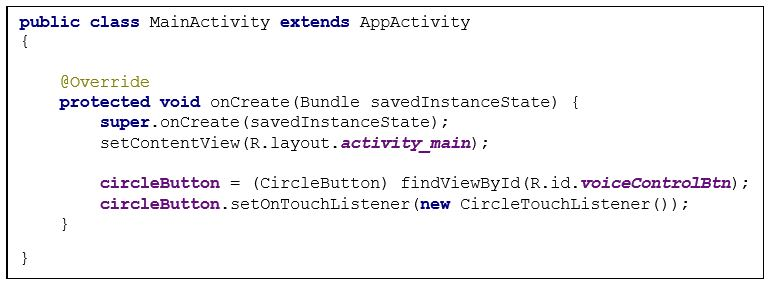
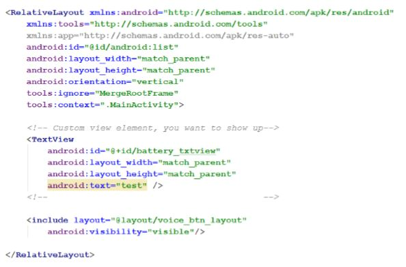
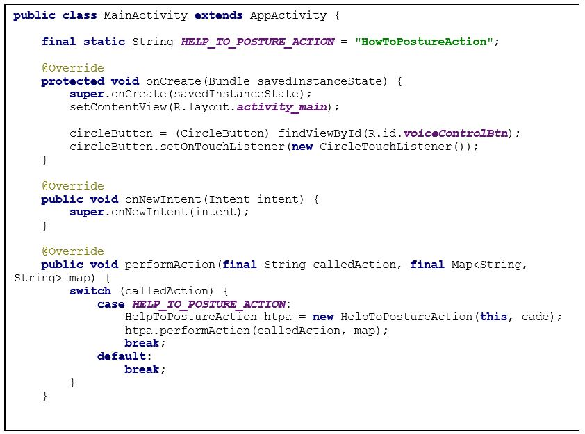
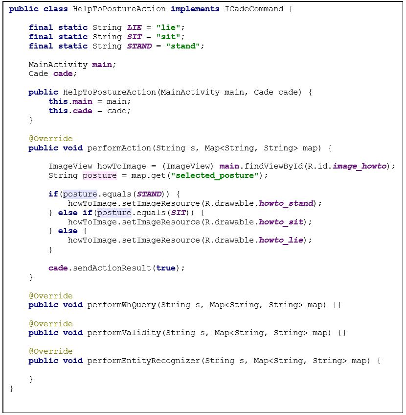
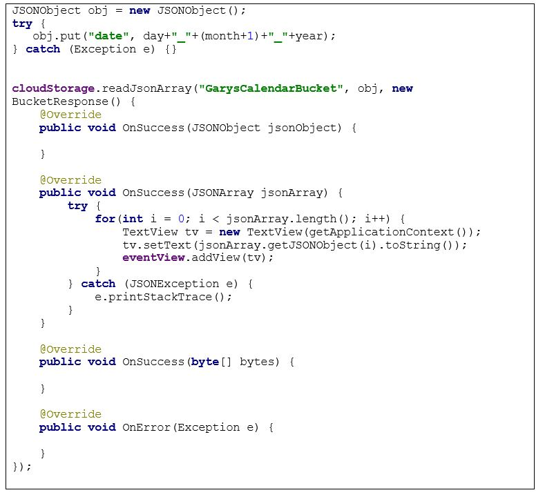

# PersonalAssistentCommons

---

### Usage Of The Personal Assistent, Personal Assistent Commons And App Development

---

## 1. Install The Personal Assistent On Your Phone

Creating an application integrated with the Personal Assistant, enables the application to have a controlled dialogue to interact faster and more human friendly than ever.
This is a system that requires the Personal Assistant, which is the controller for all the components and CADE, which handles the voice logic to enable the developers an easy access to the voice action events, which can be human friendly!

[Personal Assistent](https://github.com/ALFREDProject/PersonalAssistentApp/)

## 2. Personal Assistent Commons (PAC) - What Is This? 

This libary enables the developer to access functionalities from 

* CADE (Context-Aware Dialogue Engine) 
* KIS (Knowledge and Information Storage) 
* GM (Game Manager) 
* HM (Health Monitor) 
* PM (Personalization Manager) 
 
… which are all part of the Personal Assistent. As a result, with the help of PAC your 3rd party app may use all this functionality.  

## Execution And Usage In Android Studio

This project has the following path:

> \personalassistantcommons\PersonalAssistantShared\build\outputs\aar
 
You can find <b>PersonalAssistentShared-debug.aar</b> there. Copy it an paste the file into 

> [yourproject]\app\libs 

Run Android Studio. There, put into your build.gradle (module): 

 <dd> dependencies { </dd>
 <dd> compile fileTree(dir: 'libs', include: ['*.jar']) </dd>
 <dd> compile 'com.android.support:appcompat-v7:21.0.3' </dd>
 <dd> <b>compile 'eu.alfred.personalassistant.sharedlibrary:PersonalAssistantShared-debug@aar'</b> </dd>
 <dd> } </dd>

Build the project. 

## Using PAC In Your App

Now, the Personal Assistent Commons is in your project. To use it correctly and enable it for accessing PA modules / being accessed. Your MainActivity can extend from „AppActivity“. 
 
What AppActivity does:  
* It already integrates the every Personal Assistent Module. 
* In addition, it registers the „CircleButton“, the PA also uses. 
* Registers corresponding recievers (for start / stop listening). 

So, your on create looks like: 

<dd IMPORTANT: Dont implement your own TouchListener, otherwise it will not work. />

As you can see, you are referencing to a „CircleButton“. It is an overlay to your app GUI, so that you also will be able to continue speaking, although you are not in the Personal Assistent App itself. Define the Button also in your activity_main.xml-file: 

Till now, the app has a microphone button. Of course, you want to use the GameManager, HealthMonitor etc. as well. In addition, some methods only should be called if they are accessed via speech. Thats why you AppActivity forces you to override the following four methods: 

* PerformAction is called every time, when your DDD sends an action command to your device (for instance, call my buddy John)  
* PerformWhQuery is called every time, when your DDD sends a query to your device (for instance, return the phone number for John) 
* PerformValidity is called every time, when your DDD sends a validity request to your device (for instance, is there a phone number for my parameter „John“?) 
* PerformEntityRecognizer is called every time, when your DDD asks your device, if is has entries for a request (for instance, are there phone numbers for my parameter „John“?) 
 
* Every of these methods have firstly the name of the action as a parameter, secondly a map of other arguments your action to call might use. Here, actionname is „HowToPostureAction“, which is figured out in the switch-construct. 

==> In this example, we want to call an action, which shows an image with body posture instructions. Because we may launch different kinds of actions / query, it is recommended to use own action / query classes for this, like „HelpToPostureAction“. You could give the context and wrappers, you want to use as parameters. 
 
Lets see the action we just called.  
 
Important here: Implement ICadeCommand as an interface, so that „performAction(…)“ and others are callable in this class as well. 
 
Here, we use the arguments, our called action has beside it (Map<String,String>). For this example, the map has one key-value-pair. The key is called „selected_posture“ and is self explaining. The value however could be another String called „lie“, „sit“ or „stand“. Dependent on what the user said, the app sets an ImageView to its screen, telling how to sit, stand or lie correctly. 
 

So, we have launched our app with speech, and did an action with it. Finally, we have to inform CADE, that our speech ended, to CADE my say something like a results report. Therefore, we use „cade.sendActionResult(true)“. The same procedure has to be followed for queries, validity checks, and entity recognizers. 
 
Of course, as said in the beginning, you are able to use other APIs like KIS. Just use them in your action / query just before you call „cade.sendActionResult(true)“. Here an example for KIS, reading from a bucket created before, searching for entries for a specific date.  Except for CADE, most of other API methods have responses. So, continue coding when OnSuccess was called. 

 
 
